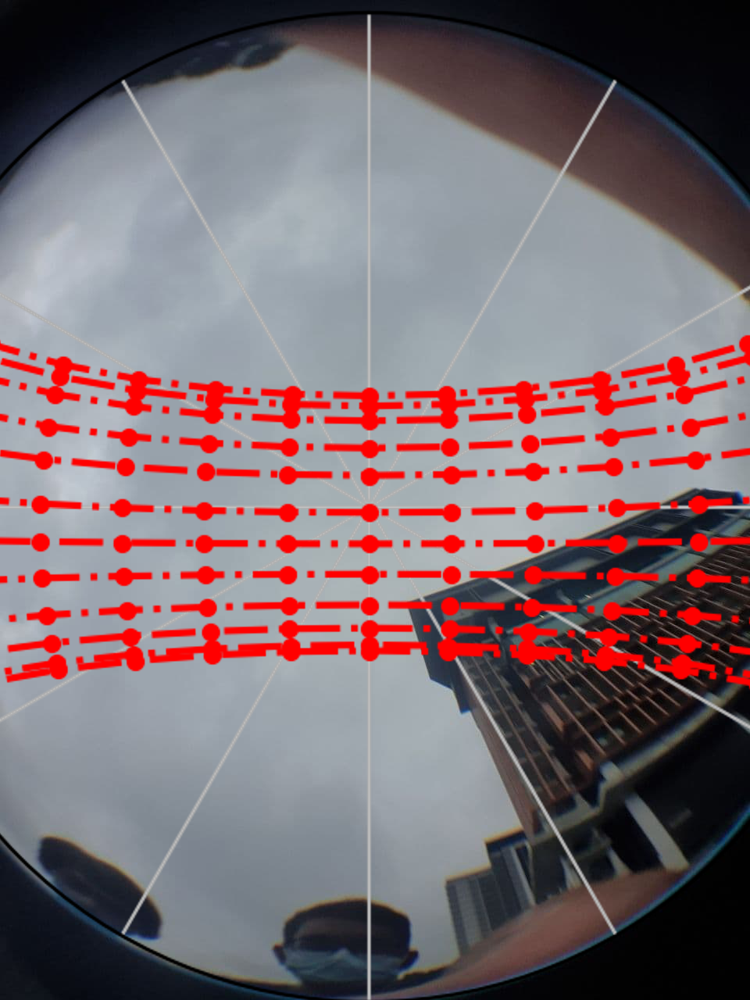

# Solar Path Overlay

Last Edited: Feb 15 2021

Tags: `python` `Open CV` `Solar Path`

Status: 🔴 Completed upto a certain portion however needs better implementation

## What is this?

Solar Path Heroku App that takes a fish eye image and super imposes the solar path on it.

## Tech Stack Used

Python and Open CV bindings for Python were used

## Current Issues

1. Issues with function paths due to env clashes
  

## Future Plans

1. Fix function path in env crashes
  
2. Deploy the service as an API using FAST API to integrate into other applications
  

---

### Socials

[LinkedIn](https://www.linkedin.com/in/ibrahimizdhanofficial/)
